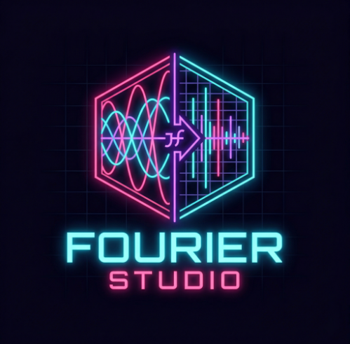

<div align="center">



# Fourier Studio

**See the Fourier Transform. Understand it. Play with it.**

[](https://python.org)
[](https://fastapi.tiangolo.com)
[](https://react.dev)
[](https://vitejs.dev)
[](https://numpy.org)
[](#)
[](LICENSE)

[**Documentation**](https://kareem-taha-05.github.io/Fourier-Studio) · [**Report a Bug**](https://github.com/Kareem-Taha-05/Fourier-Studio/issues) · [**Request a Feature**](https://github.com/Kareem-Taha-05/Fourier-Studio/issues)


</div>

---

Fourier Studio is a real-time 2D Fourier Transform workbench built for engineers, researchers, and anyone who wants to build genuine intuition for how images behave in the frequency domain.

Load images, mix their frequency components, apply classical signal processing transforms, and watch every change propagate instantly across both spatial and frequency domain views. No manual refreshing. No waiting. No black box.

---

## What it does

### FT Mixer

<br/>


<br/><br/>

Load up to four images simultaneously. Assign each one a role — contribute its **magnitude**, **phase**, **real part**, or **imaginary part** — weight each contribution independently, and reconstruct a new image via Inverse FFT.

Every slider move triggers a fresh computation. Change a weight, switch a role, or draw a frequency region mask and see the output update in under 200ms. The previous computation is cancelled automatically so you are never waiting for stale results.

```
Image 1  ──[MAG × 0.8]──┐
Image 2  ──[PHS × 1.0]──┤──► IFFT ──► Output
Image 3  ──[MAG × 0.3]──┘
```

### FT Emphasizer

<br/>


<br/><br/>

Pick a transform, apply it to an image, and watch what happens to its spectrum in real time across four synchronized display panels. Or flip the domain — apply the same transform directly to the Fourier spectrum and watch the image reconstruct itself differently.

Every transform ships with a plain-English explanation of what is happening in both domains and why, grounded in the underlying mathematical duality.

| Transform | What you observe |
|---|---|
| Shift | Spectrum magnitude unchanged — only phase rotates |
| Stretch | Spectrum compresses as the image expands |
| Differentiate | Edges sharpen spatially; high frequencies amplify |
| Window | Spectral leakage dissolves as the window smooths |
| Make Even / Odd | FT becomes purely real or purely imaginary |
| Rotate | Spectrum rotates in lockstep |
| Integrate | Low-pass smoothing in the frequency view |

Full User Guide: [https://kareem-taha-05.github.io/Fourier-Studio/usage](https://kareem-taha-05.github.io/Fourier-Studio/usage)

---

## Getting started

**Requirements:** Python 3.10+, Node.js 18+

```bash
git clone https://github.com/Kareem-Taha-05/Fourier-Studio.git
cd Fourier-Studio

# Backend
cd backend
python -m venv .venv && source .venv/bin/activate   # Windows: .venv\Scripts\activate
pip install -r requirements.txt
uvicorn app.main:app --reload --port 8000

# Frontend — open a second terminal
cd frontend-app
npm install
npm run dev
```

Open **http://localhost:5173**. The navbar shows a green **SYS ONLINE** indicator when the backend is connected.

Full Getting Started Guide: [https://kareem-taha-05.github.io/Fourier-Studio/installation](https://kareem-taha-05.github.io/Fourier-Studio/installation)

---

## Tech stack

| Layer | Technology |
|---|---|
| API | FastAPI 0.111 + Uvicorn |
| Math | NumPy 1.26 (FFT/IFFT), Pillow (image I/O) |
| Validation | Pydantic v2 |
| Frontend | React 19 + Vite 8 |
| State | Zustand 5 |
| HTTP client | Axios (with `AbortController` cancellation) |
| Fonts | Orbitron · VT323 · Share Tech Mono |

---

## Architecture

All image mathematics lives exclusively in service classes — nothing in API handlers. The `ImageProcessor` base class handles FFT caching, normalisation, and encoding. `EmphasizerProcessor` extends it with the nine transform methods. `MixerService` handles weighted FT composition.

```
ImageProcessor          ← base class, lazy FFT cache
  └── EmphasizerProcessor   ← 9 transform methods
ImageRegistry           ← in-memory UUID store
MixerService            ← weighted mixing + IFFT
```

The frontend uses a `latestRef` pattern in debounced effects so timeouts always read current state rather than stale closure values. The Emphasizer keeps a `displayResult` local state that only updates on complete responses, preventing panel flicker during rapid slider interaction.

Full architecture documentation: [kareem-taha-05.github.io/Fourier-Studio/architecture](https://kareem-taha-05.github.io/Fourier-Studio/architecture)

---

## API

The backend exposes a clean REST API documented interactively at `http://localhost:8000/docs`.

| Method | Endpoint | Description |
|---|---|---|
| `POST` | `/api/v1/images/upload` | Upload an image, receive `image_id` |
| `POST` | `/api/v1/images/ft-component` | Get magnitude/phase/real/imaginary as PNG |
| `POST` | `/api/v1/mixer/mix` | Run weighted FT mix, receive result PNG |
| `POST` | `/api/v1/emphasizer/apply` | Apply transform, receive 4-panel PNG set |
| `GET` | `/health` | Health check |

---

## Project structure

```
Fourier-Studio/
├── backend/
│   └── app/
│       ├── api/           # Route handlers (images, mixer, emphasizer)
│       ├── services/      # ImageProcessor, MixerService, EmphasizerProcessor
│       ├── models/        # Pydantic schemas
│       └── core/          # Settings
├── frontend-app/
│   └── src/
│       ├── components/    # NavBar, ImageViewport, MixerControls, InfoCard
│       ├── pages/         # MixerPage, EmphasizerPage
│       ├── store/         # Zustand state
│       └── utils/         # API client, educational content
├── tests/                 # 58 pytest tests (unit + integration)
├── docs/                  # MkDocs documentation source
└── examples/              # Standalone Python scripts using the API
```

---

## Running tests

```bash
# From the repo root
pip install -r requirements-dev.txt
pytest tests/ -v
```

58 tests covering upload, FT component retrieval, resize, mix operations, all 10 transforms, both domain modes, and the service layer math directly.

---

## Known limitations

- **Single-user by design** — images are stored in memory, scoped to the server process. Multiple tabs share the same registry. Session isolation would require token-based routing.
- **Grayscale only** — colour images are converted to grayscale on upload. Per-channel FT is on the roadmap.
- **No persistence** — the image registry resets on server restart. Disk or Redis-backed storage is straightforward to add by replacing `ImageRegistry`.

---

## Contributing

See [CONTRIBUTING.md](CONTRIBUTING.md) for branch conventions, commit format, and the review process.

---

## License

MIT — see [LICENSE](LICENSE).
